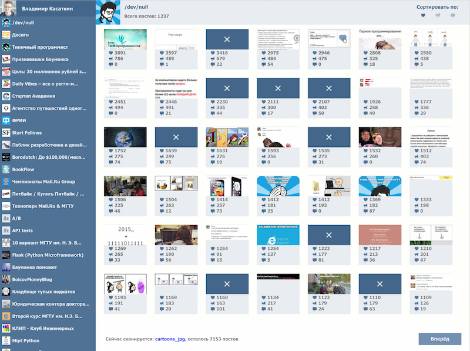

<b>VKSMM</b> is a cool service to get the most popular content from your "vk.com" communities

Screenshot: 



## How to:

1) Setup required modules in virtual environment:

```bash
$ virtualenv venv
$ venv/bin/pip install -r requirements.txt
```

2) Create MySQL database

```bash
$ mysql -e "create database vksmmdb charset utf8"
```

3) Run parser [in a screen]

```bash
$ screen python vkparser.py
```

CTRL+A+D to detach the screen, CTRL+C to kill. Actually this is a bad practice but easy to start.

4) Setup NGNIX-server and Gunicorn, following  <a href="https://realpython.com/blog/python/kickstarting-flask-on-ubuntu-setup-and-deployment/">this article</a>, restart it and run app from the project folder, e.g:

```bash
$ sudo /etc/init.d/nginx restart
$ cd user/vksmmmtool
$ gunicorn -w 2 -b localhost:8000 server:app --daemon
```

This project in my portfolio: [http://vksmm.info/project/4/](http://vksmm.info/project/4/)

## Future steps:

* Write deploy scripts
* Save nginx, gunicorn and upstart scripts for backend and parser
